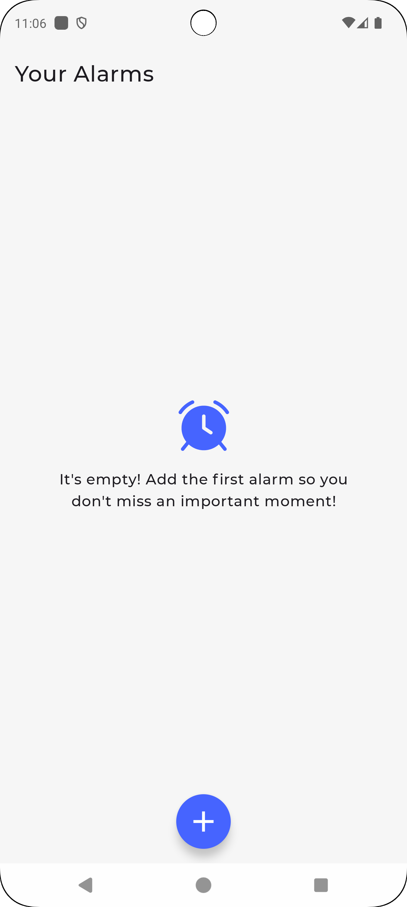
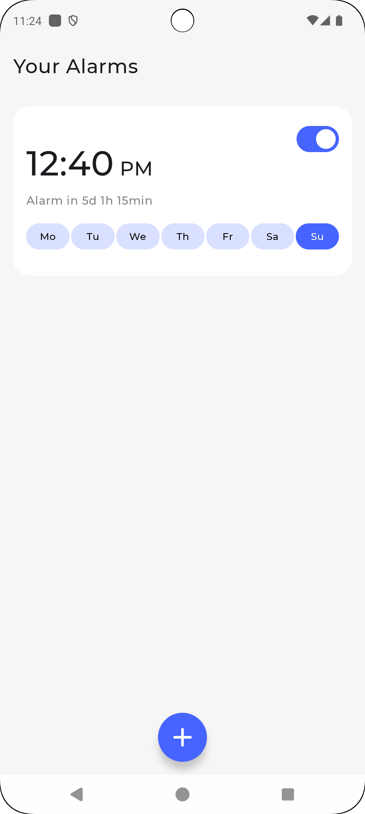
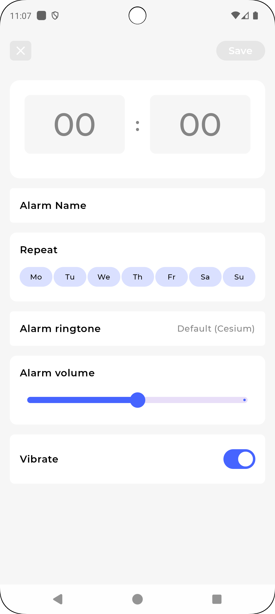
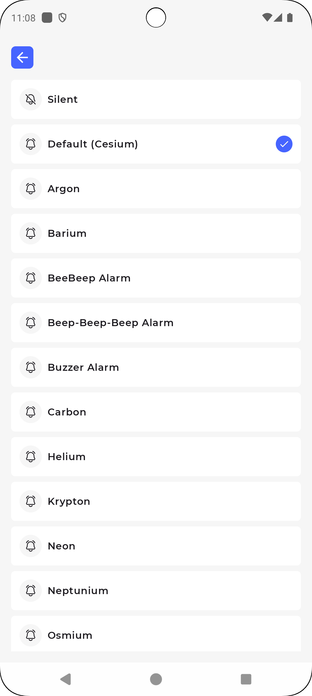
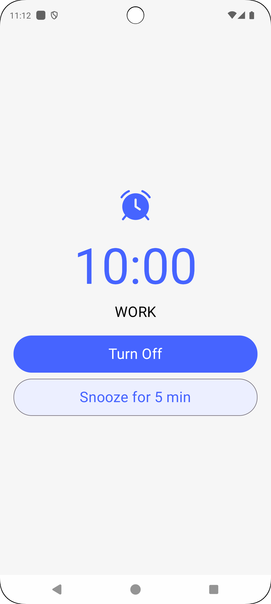

# Snoozeloo

Soozeloo is an application for creating alarms that can be scheduled once or on different days.

## Technologies Used

- Jetpack Compose  
- MVI
- Clean Code  
- Koin (Dependency Injection)
- Room Database  
- Android Notifications
- Andorid Broadcast

## Screenshots

  
  
  
  
  
  

